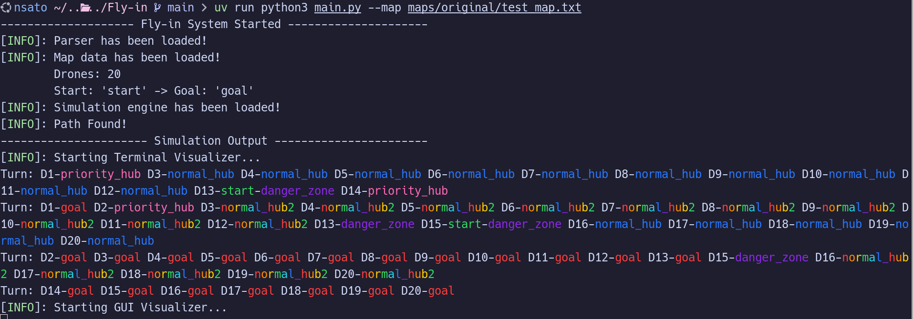
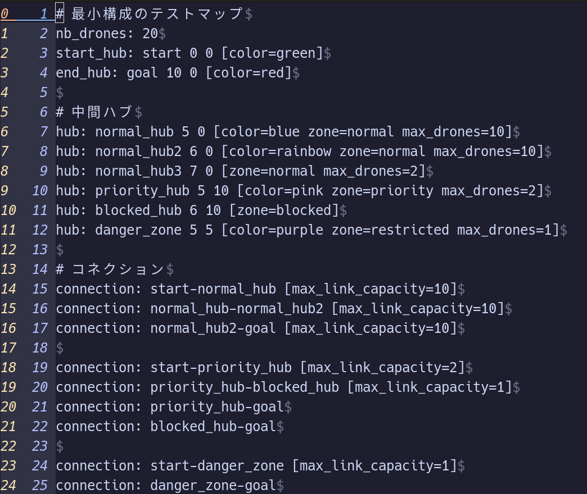
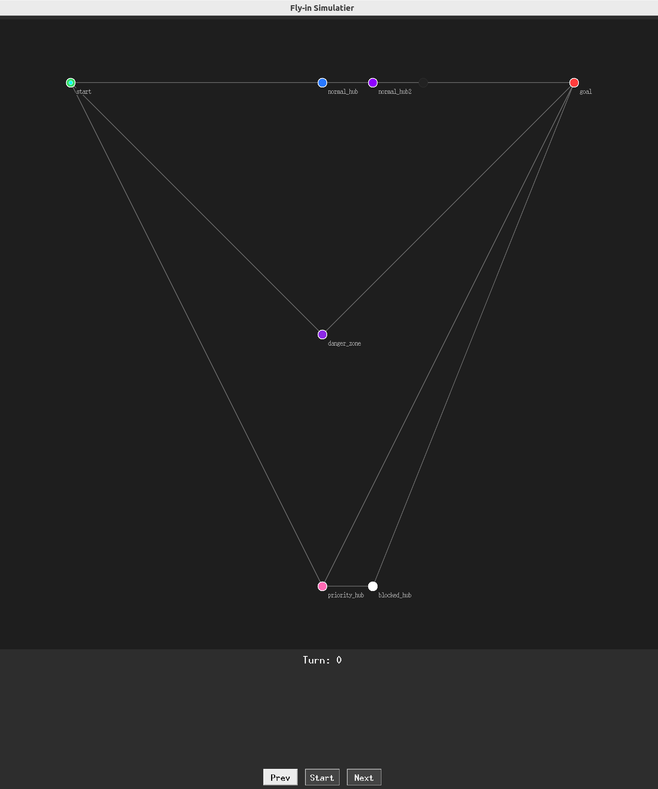
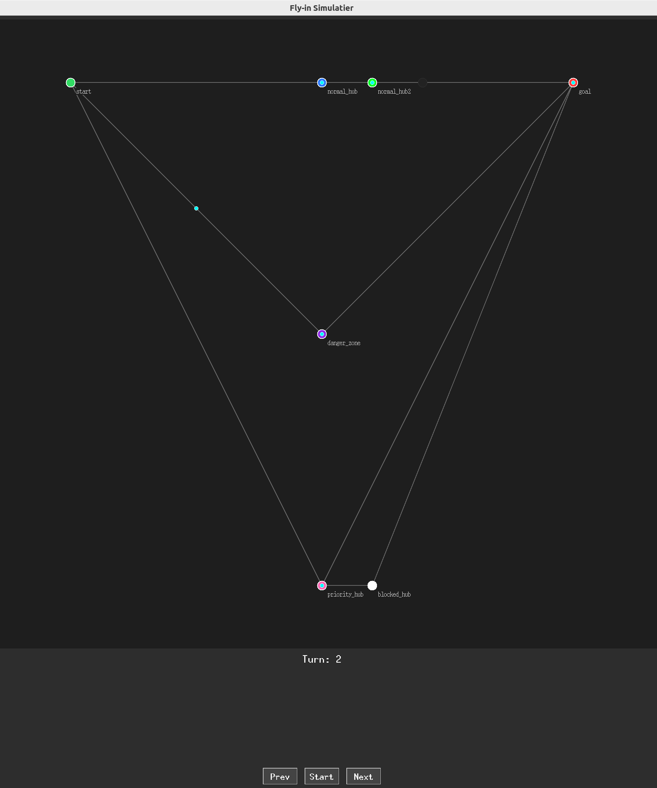
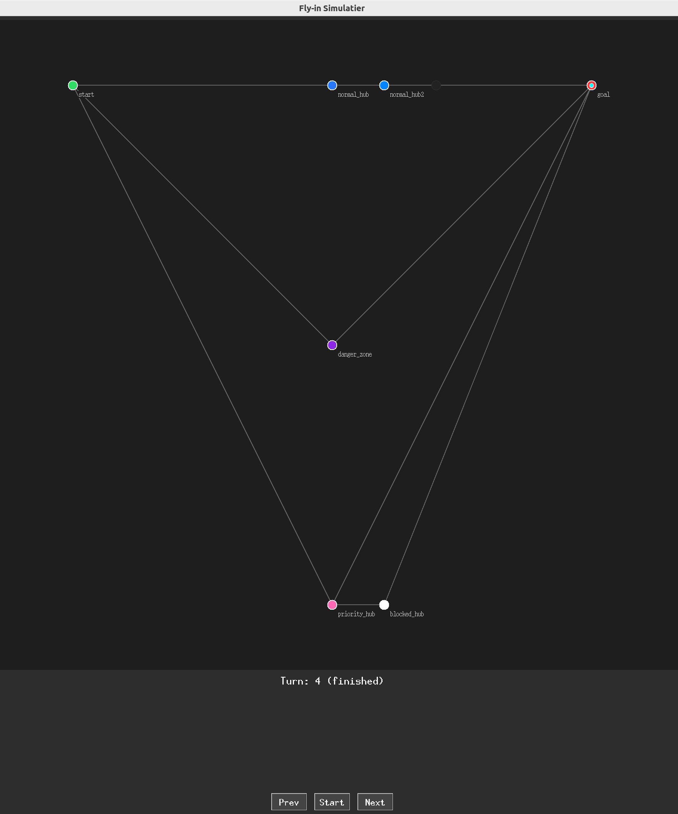

*This project has been created as part of the 42 curriculum by nsato.*

<table>
	<thead>
    	<tr>
      		<th style="text-align:center"><a href="README.md">英語</a></th>
      		<th style="text-align:center">日本語</th>
    	</tr>
  	</thead>
</table>

<h1>
	Fly-in
</h1> <H2>
	ドローンは面白い。
</H2>



## 📖*Content*
1. [💡概要](#1-概要)
2. [✅ファイル構成](#2-ファイル構成)
3. [✅手順](#3-手順)
4. [⛏追加要件](#4-追加要件)
	1. [アルゴリズムの選択と実装戦略](#4-1-アルゴリズムの選択と実装戦略)
	2. [Dijkstraアルゴリズムの選択理由](#4-2-Dijkstraアルゴリズムの選択理由)
	3. [視覚的表現の機能とユーザー体験の向上](#4-3-視覚的表現の機能とユーザー体験の向上)
5. [入出力例](#5-入出力例)
6. [🎁ボーナス](#6-ボーナス)
7. [🌈リソース](#7-リソース)
	1. [参考URL](#7-1-参考URL)
	2. [AIの使用について](#7-2-AIの使用について)


## 💡1. 概要
動的なネットワークを介して、複数の自律型ドローンを中央基地から目標地点まで誘導する、効率的なドローン経路探索システムを設計・実装します。  
このPythonプロジェクトでは、ゾーン占有ルール、移動コスト、衝突解決を遵守しつつ、ドローンの同時移動を処理する独自の経路探索アルゴリズムを作成することが求められます。  
システムは、複雑なマップファイルを解析し、オブジェクト指向設計の原則を実装し、シミュレーションのターン数を最小限に抑えるよう最適化する必要があります。 
学習者は、制限区域、ボトルネック、デッドロック防止といった現実世界の制約に対処しながら、グラフアルゴリズム、並行経路探索、およびパフォーマンス最適化のスキルを習得します。  
（プロジェクトPDFより）  

### 📁2. ファイル構成
```
| - Makefile
| - README.md
| - README_ja.md
| - .images
| - .gitignore
| - .flake8
| - main.py
| - Parser.py
| - Graph.py
| - Zone.py
| - Connection.py
| - PathFinder.py
| - Drone.py
| - SearchState.py
| - SimulationEngine.py
| - TreminalVizualizer.py
| - GUIVisualizer.py
| - ColorManager.py
| - tests
```

## ✅3. 手順

- もしuvがインストールされていない場合、uvの公式インストーラスクリプトを実行してください。  
```
make uv-install
```

または
```
curl -LsSf https://astral.sh/uv/install.sh | sh
```

- 実行は以下のコマンドで行います。  
*Makefile使用時はデフォルトのファイルのみ指定可能です。*  
```
make run
```
- map ファイルを指定して実行する場合は、以下のコマンドを使用してください。
```
uv run main.py -m <map_file>
```
- 型ヒントなどコードのスタイルチェックを行う場合は、以下のコマンドを使用してください。
```
make lint
```
より厳密なチェックを行う場合は、以下のコマンドを使用してください。
```
make lint-strict
```
  
- `make run`で自動で仮想環境が構築されます。
	もし構築されない場合以下の手順を実行してください。
1. 仮想環境の構築。  
```
make setup
```
2. 同期
```
make install
```
- その他のコマンドは以下の通りです。

- キャッシュファイルの削除
```
make clean
```
- 仮想環境も含めたファイルの削除
```
make fclean
```

## ⛏4. 追加要件
### 4-1. アルゴリズムの選択と実装戦略
- このプロジェクトでは、複数のドローンが同時に移動するため、各ドローンの経路を効率的に計算する必要があります。  
- そのため、A*アルゴリズムやDijkstraアルゴリズムなどのグラフ探索アルゴリズムを使用し、各ドローンの最短経路を計算します。  
- また、ドローン同士の衝突を避けるために、各ドローンの経路を計算する際に、他のドローンの位置を考慮する必要があります。  
- さらに、ゾーン占有ルールや移動コストを考慮し、最適な経路を選択するためのアルゴリズムを実装します。  
- 実装戦略としては、まずマップファイルを解析し、グラフ構造を構築します。次に、各ドローンの初期位置と目標位置を設定し、各ドローンの経路を計算します。
- 各ドローンの経路計算を1台づつ行い、その都度Zone, Connectionに占有状況を反映させることで、衝突を避けるようにしました。  
- 最後にシミュレーションを実行し、各ドローンの移動を可視化し、実装時のデバッグの支援を行いました。  
- 経路探索クラスであるPathFinderは、優先度付きキューを用いてコストが最小となる経路を貪欲に探しつつ、コスト計算にpriority=0.99のような細工をすることで優先ルートを誘導し、同時に(ターン、場所)の二次元で訪問判定を行うことで、動的な障害物（他のドローン）を待機して避けるような経路を導き出す戦略を取っています。

### 4-2. Dijkstraアルゴリズムの選択理由
- ダイクストラ法 (Dijkstra's Algorithm) は最短経路問題を効率的に解くグラフ理論におけるアルゴリズムです。スタートノードからゴールノードまでの最短距離とその経路を求めることができます。  
- このプロジェクトでは、ドローンが複数存在し、同時に移動するため、各ドローンの経路を効率的に計算する必要があります。ダイクストラ法は、非負のエッジコストを持つグラフに対して最適な解を提供するため、ドローンの移動コストを考慮した経路計算に適しています。  
- また、ダイクストラ法は、A*アルゴリズムのようなヒューリスティックを必要とせず、単純なグラフ構造に対しても効果的に機能します。これにより、ドローンの移動コストやゾーン占有ルールを考慮した経路計算が容易になります。  
- 各ドローンの経路計算を1台づつ行い、その都度Zone, Connectionに占有状況を反映させることで、衝突を避けるようにします。これにより、ドローン同士の衝突を避けながら、最適な経路を選択することができます。  

### 4-3. 視覚的表現の機能とユーザー体験の向上
- このプロジェクトでは、ドローンの移動を視覚的に表現するために、ターミナル上での可視化とGUIでの可視化の両方を実装しました。  
- ターミナル上での可視化では、各ドローンの位置をリアルタイムで表示し、ユーザーがドローンの移動を文字で確認できるようにしました。  
- GUIでの可視化では、ドローンの移動をアニメーションで表示し、ユーザーがドローンの経路を直感的に理解できるようにしました。  
- また、GUIでの可視化では到達不可能なゾーンを暗く表示することで、ユーザーがドローンの移動可能な範囲を直感的に理解できるようにします。  

### 5. 入出力例
- `uv run main.py -map <map_file>`で、マップファイルを指定可能。  

- ターミナル上で、ドローンの移動をリアルタイムで表示することができます。  
- ターミナルに表示される内容は、各ドローンの位置を示す文字列で、  
Zoneの場合は`D<ID>-<zone>`、Connectionの場合は`D<ID>-<connection>`で表示されます。  


- マップファイルの例は以下の通りです。  



- 上記のようなマップファイルを指定した場合、以下のようなドローンがStartからGoalまで移動する様子がGUIで表示されます。  



- ドローンの移動は、各ターンごとに更新され、ドローンの位置がリアルタイムで表示されます。  



- ドローンが目標地点に到達するまで、シミュレーションは続きます。最終的に、全てのドローンが目標地点に到達した状態が表示されます。  




- プログラムの終了はEscapeキーか、GUIの×ボタン、TerminalのCtrl+Cで終了可能です。  

## 🎁6. ボーナス
- Bonusの条件は、提供されたマップファイルを指定ターンいないで実行可能であることです。
- 今回の実装では特別な処理を入れることなく、全てのマップファイルを指定ターン以内で実行可能な状態になりました。  

## 🌈7. リソース

### 7-1. 参考URL
[Python defaultdict の使い方](https://qiita.com/xza/items/72a1b07fcf64d1f4bdb7)  
[ダイクストラ法最短経路問題](http://www.deqnotes.net/acmicpc/dijkstra/)  
[初心者のためのダイクストラアルゴリズム](https://qiita.com/knhr__/items/cb3ce311508337128714)  
[tkinter Python Documentation](https://docs.python.org/ja/3.14/library/tkinter.html)  
[GoogleスタイルのPython Docstringの入門](https://qiita.com/11ohina017/items/118b3b42b612e527dc1d)

### 7-2. AIの使用について
- Antigravity
	- タスクリストのまとめ、チェック
	- コードのリファクタリング
	- GUIの実装時必要なメソッドの提案、勉強の壁打ち
- Copilot
	- Docstringの生成時、スタイルの統一